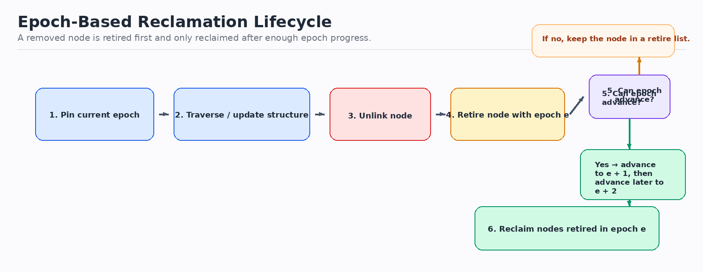
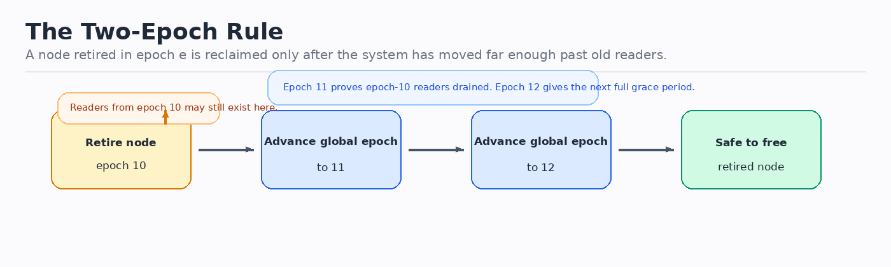
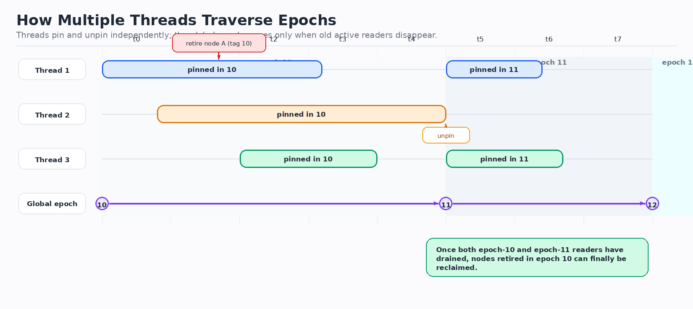

# Epoch-Based Reclamation: A Practical Tutorial

**Estimated reading time: ~15 minutes**

Epoch-based reclamation (EBR) is a way to free removed nodes in concurrent data structures **without freeing them while another thread might still be reading them**.

This tutorial is aimed at software developers. It focuses on the mental model first, then the mechanics.

---

## Table of Contents

1. [The problem EBR solves](#1-the-problem-ebr-solves)
2. [EBR in 30 seconds](#2-ebr-in-30-seconds)
3. [Core concepts and vocabulary](#3-core-concepts-and-vocabulary)
4. [How the algorithm works](#4-how-the-algorithm-works)
5. [Why waiting two epochs is enough](#5-why-waiting-two-epochs-is-enough)
6. [How multiple threads traverse epochs](#6-how-multiple-threads-traverse-epochs)
7. [Worked example](#7-worked-example)
8. [Minimal pseudocode](#8-minimal-pseudocode)
9. [What EBR guarantees](#9-what-ebr-guarantees)
10. [Where EBR fits well](#10-where-ebr-fits-well)
11. [Pitfalls and limitations](#11-pitfalls-and-limitations)
12. [EBR vs hazard pointers vs RCU](#12-ebr-vs-hazard-pointers-vs-rcu)
13. [Implementation checklist](#13-implementation-checklist)
14. [Where quiescent reclamation fits](#14-where-quiescent-reclamation-fits)
15. [What using an EBR API looks like](#15-what-using-an-ebr-api-looks-like)

---

## 1. The problem EBR solves

Suppose a lock-free stack contains node `N`.

1. `Thread A` reads a pointer to `N`.
2. `Thread B` unlinks `N` from the stack.
3. `Thread B` immediately frees `N`.
4. `Thread A` dereferences `N`.

That is a use-after-free bug.

The key difficulty is this:

> unlinking a node does not prove that no thread still holds an old pointer to it.

Concurrent readers may have seen the node just before it was removed. So reclamation must be delayed until those older readers are definitely gone.

That is what EBR does.

---

## 2. EBR in 30 seconds

EBR works like this:

1. A thread enters the data structure and marks itself as **active**.
2. It also records the current **global epoch**.
3. If a node is removed, the node is **retired**, not freed.
4. Threads occasionally try to advance the global epoch.
5. An epoch advance is allowed only when no active thread is still in an older epoch.
6. A node retired in epoch $e$ is reclaimed only after the system has advanced far enough past $e$, typically to at least $e + 2$. 

Intuitively, a thread may advance the global epoch from $e$ to $e + 1$ even if other threads are still active, as long as those threads are also in epoch $e$ rather than an older one. That means the system never moves forward while some thread is still carrying an older view.

What about a new thread that enters in epoch $e + 1$? That is fine. It was not active back in epoch $e$, so it cannot be one of the readers that might still have seen the node before it was retired. By the time the global epoch reaches $e + 2$, the readers from epoch $e$ have drained, and the readers that entered in epoch $e + 1$ have also had a full chance to finish. That is why reclaiming nodes retired in epoch $e$ is safe at that point.

If you want a one-line summary:

> remove now, retire now, free later.

---

## 3. Core concepts and vocabulary

### 3.1 EBR domain

An **EBR domain** is the shared bookkeeping for one reclamation system.

It usually contains:

- one global epoch counter,
- one per-thread record for each participating thread,
- and one or more retire lists.

### 3.2 Registered thread

A **registered thread** is simply a thread that has a published per-thread record inside the EBR domain.

That record is what other threads inspect.

This does **not** require a permanently fixed set of threads for the whole lifetime of the program.

Two common models are:

- **fixed worker set**: a small, long-lived pool of worker threads registers once and stays registered,
- **dynamic registration**: threads register when they begin using the data structure and unregister when they are done.

So sporadic threads are possible, but they must follow the registration protocol correctly. A thread cannot safely touch EBR-protected nodes unless it has a current registered record that other threads can see.

### 3.3 Announce, pin, and unpin

These words all describe updates to that per-thread record.

Conceptually, a record looks like this:

```text
Thread 7:
  active = true
  local_epoch = 42
```

- `active = true` means the thread is currently inside an EBR-protected critical section.
- `local_epoch = 42` means it entered while the global epoch was `42`.

This is what people mean by saying the thread has **announced** its state.

When a thread enters the data structure, it **pins** itself:

1. read `global_epoch`
2. write `active = true`
3. write `local_epoch = that value`

When it leaves the critical section, it **unpins** itself:

```text
active = false
```

So:

- **pinned** = active inside the structure,
- **unpinned** = not currently participating.

### 3.4 Retire vs reclaim

These are different.

- **Retire** means: the node has been unlinked, but cannot be freed yet.
- **Reclaim** means: the node is now safe to free.

EBR exists to manage the gap between those two moments.

### 3.5 Global epoch

The **global epoch** is a shared counter such as `0`, `1`, `2`, ... or a modulo-3 cycle.

It is not a precise timestamp. It is just a broad generation marker used for reclamation.

---

## 4. How the algorithm works

### 4.1 The basic flow



At a high level:

1. a thread pins,
2. it traverses or updates the shared structure,
3. removed nodes are retired with the current epoch,
4. threads occasionally try to advance the global epoch,
5. old retired nodes are eventually reclaimed.

### 4.2 What "announced state" means

When people say "check the announced state of all registered threads", they mean:

> scan each thread's published record and inspect its `active` flag and `local_epoch`.

For example:

```text
T1: active = true,  local_epoch = 42
T2: active = false
T3: active = true,  local_epoch = 42
T4: active = false
```

This tells a scanning thread that:

- `T1` is pinned in epoch `42`,
- `T2` is inactive,
- `T3` is pinned in epoch `42`,
- `T4` is inactive.

### 4.3 When the epoch number advances

The global epoch does **not** advance automatically.

It advances only when some ordinary thread explicitly tries to move it forward. Common times to try are:

- after retiring nodes,
- when a retire list gets large,
- during cleanup,
- or when leaving a critical section.

So if the current epoch is `42`, that just means earlier attempts already moved it from some earlier values:

```text
39 -> 40 -> 41 -> 42
```

There is nothing special about `42`. It is just the current value right now.

### 4.4 The advance check

Suppose the current global epoch is `42`.

A thread trying to advance it does this:

1. read `global_epoch`
2. scan every registered thread record
3. ignore threads with `active = false`
4. if any active thread has `local_epoch < 42`, stop
5. otherwise try to change `global_epoch` from `42` to `43`

That last step is usually an atomic compare-and-swap.

If another thread wins the race and already advanced the counter, that is fine. The important part is the rule:

> do not advance while an active thread is still pinned in an older epoch.

### 4.5 A concrete pass/fail example

This table allows advancement:

```text
T1: active = true,  local_epoch = 42
T2: active = false
T3: active = true,  local_epoch = 42
```

All active threads are already in the current epoch.

This table blocks advancement:

```text
T1: active = true,  local_epoch = 42
T2: active = false
T3: active = true,  local_epoch = 41
```

`T3` is still pinned in an older epoch, so reclaimers must wait.

---

## 5. Why waiting two epochs is enough

In many EBR designs, a node retired in epoch $e$ is reclaimed only after the global epoch reaches at least $e + 2$.



The usual intuition is:

- advancing from $e$ to $e + 1$ proves that active threads from epoch $e$ have drained,
- advancing from $e + 1$ to $e + 2$ proves that readers which entered during epoch $e + 1$ have also drained.

So by the time the system is at $e + 2$, a node retired in epoch $e$ is separated from all older in-flight readers by a full grace period.

Different implementations package the bookkeeping differently, but "wait two epochs" is the right mental model.

---

## 6. How multiple threads traverse epochs

Threads do not move in lockstep. They pin and unpin at different times.



Read the diagram like this:

- the colored bars show when each thread is pinned,
- the bottom row shows global epoch changes,
- nodes retired in an older epoch remain deferred until the older readers are gone.

The important idea is simple:

> epoch advancement depends on who is still active, not on all threads moving together.

---

## 7. Worked example

Assume a lock-free stack and current global epoch `7`.

### Step 1: two threads are active

```text
global_epoch = 7
T1: active in 7
T2: active in 7
T3: inactive
```

### Step 2: `T1` removes node `N`

`T1` unlinks `N` from the stack.

It still must not free `N`, because `T2` may already hold a pointer to it.

So `T1` does this instead:

```text
retire(N, epoch = 7)
```

### Step 3: `T1` tries to advance the epoch

It scans the thread records.

- `T1` is active in `7`
- `T2` is active in `7`
- `T3` is inactive

An advance to `8` is allowed only if no active thread is still in an older epoch than the current one. Here, both active threads are in `7`, so an advance can succeed.

After that, the system may have:

```text
global_epoch = 8
```

### Step 4: reclamation still does not happen

Even after moving to `8`, node `N` is not freeable yet, because it was retired in `7` and the usual rule is to wait until at least `9`.

### Step 5: activity continues in epoch 8

Suppose `T3` pins in epoch `8` and traverses the stack.

That is fine. The node retired in `7` still waits.

### Step 6: the epoch advances again

Once active readers from epoch `8` have drained, some thread can advance the global epoch to `9`.

Now nodes retired in epoch `7` become reclaimable:

```text
free(N)
```

### Why this works

Any thread that could still have seen `N` while it was reachable must have been part of an earlier critical section. By the time the system reaches `9`, those earlier readers have drained out.

---

## 8. Minimal pseudocode

This pseudocode omits important low-level details like memory ordering, but it captures the structure.

### 8.1 Pin and unpin

```text
function pin(thread):
    e = global_epoch.load()
    thread.local_epoch = e
    thread.active = true
    return e

function unpin(thread):
    thread.active = false
```

### 8.2 Retire a node

```text
function retire(thread, node):
    e = global_epoch.load()
    thread.retired[e].push(node)
```

### 8.3 Try to advance the global epoch

```text
function try_advance():
    current = global_epoch.load()

    for each thread t:
        if not t.active:
            continue
        if t.local_epoch < current:
            return

    global_epoch.compare_exchange(current, current + 1)
```

### 8.4 Reclaim old retired nodes

```text
function collect(thread):
    current = global_epoch.load()

    for each retired_epoch in thread.retired:
        if retired_epoch <= current - 2:
            free_all(thread.retired[retired_epoch])
```

Many real implementations use three rotating bags or buckets instead of an unbounded map. The idea is the same.

---

## 9. What EBR guarantees

EBR guarantees this:

> a retired node will not be reclaimed until the older critical sections that could still reference it have completed.

It does **not** guarantee:

- immediate reclamation,
- bounded memory usage if a thread stays pinned forever,
- safety for pointers used outside the EBR protocol.

The guarantee depends on a strict rule:

> every reader must pin before dereferencing protected nodes and unpin afterward.

---

## 10. Where EBR fits well

EBR works especially well for:

- lock-free stacks,
- lock-free queues,
- linked lists,
- skip lists,
- hash tables,
- tree-like structures with short critical sections.

It is a good fit when:

- critical sections are short,
- threads regularly become quiescent,
- deferred reclamation is acceptable,
- and low reader overhead matters.

---

## 11. Pitfalls and limitations

### 11.1 Stalled pinned threads delay reclamation

If a thread pins and then blocks, sleeps, or crashes, old retired nodes may accumulate.

This is the classic weakness of EBR.

### 11.2 Long critical sections slow cleanup

The longer a thread stays pinned, the longer old epochs remain unreclaimable.

### 11.3 EBR protects protocol participants only

If code keeps a raw pointer and later uses it outside a pinned section, EBR does not protect that usage.

### 11.4 Memory ordering still matters

The high-level story is simple. Correct atomics are not.

Implementations still need proper ordering for:

- publishing pinned state,
- reading announced records,
- updating retire lists,
- and freeing memory safely.

---

## 12. EBR vs hazard pointers vs RCU

| Technique | Main idea | Strengths | Weaknesses |
|-----------|-----------|-----------|------------|
| **EBR** | Readers publish a coarse epoch | Cheap fast path, simple batching | Stalled pinned threads delay reclamation |
| **Hazard pointers** | Readers publish exact pointers they may touch | Precise protection | Higher per-access bookkeeping |
| **RCU** | Readers run inside read-side critical sections while reclamation waits for grace periods | Extremely cheap reads | More specialized environment and API model |

Rule of thumb:

- choose **EBR** when short critical sections and cheap reader overhead matter,
- choose **hazard pointers** when precise per-pointer protection matters more,
- choose **RCU** for strongly read-heavy environments that fit the RCU model.

---

## 13. Implementation checklist

### Correctness

- Do all readers pin before dereferencing protected nodes?
- Do they unpin promptly?
- Are retired nodes tagged with the current epoch?
- Is epoch advancement blocked by active threads from older epochs?
- Are nodes reclaimed only after the required grace period?

### Performance

- Are retired nodes batched?
- Are thread-local retire lists used?
- Is epoch advancement attempted occasionally rather than on every read?
- Are critical sections short enough that epochs keep moving?

### Operational concerns

- What happens if a thread stalls while pinned?
- Can dead threads be unregistered?
- Is deferred memory growth acceptable for this workload?

---

## 14. Where quiescent reclamation fits

It does make sense to mention **quiescent-state-based reclamation** here, because it is closely related to EBR.

The core idea is similar:

- readers do very little bookkeeping,
- removed nodes are deferred,
- reclamation waits until old readers are known to be gone.

The main difference is what the system waits for.

- In **EBR**, threads publish the epoch they are currently in.
- In **quiescent reclamation** (often called **QSBR**), threads periodically report that they passed through a **quiescent state** — a point where they are guaranteed not to hold references into the shared structure anymore.

Typical quiescent states are:

- finishing a request,
- returning to an event loop,
- reaching the end of a transaction,
- or any point where the thread can guarantee it is not still traversing protected nodes.

So the trade-off is:

- **EBR** tracks whether a thread is currently active and which epoch it entered in.
- **QSBR** tracks whether each thread has reported a safe point since reclamation was deferred.

QSBR is often attractive when the program already has natural quiescent points, such as:

- event-driven servers,
- batch-processing systems,
- single-threaded reactors with worker handoff,
- or systems where threads regularly return to a known idle boundary.

It is less attractive when threads can stay deep inside long-running operations without clearly reporting quiescent states.

You can think of QSBR as a sibling of EBR:

> instead of asking "which epoch did this thread enter in?", it asks "has this thread passed through a known-safe point since this node was retired?"

---

## 15. What using an EBR API looks like

The internal bookkeeping can make EBR feel abstract, so it helps to see the application-facing shape.

Even though APIs differ, most EBR libraries expose some version of these ideas:

- create or access an EBR domain,
- register the current thread,
- pin before traversing shared nodes,
- read or update the concurrent structure,
- retire removed nodes instead of freeing them directly,
- let the library eventually reclaim those retired nodes.

Below are language-neutral sketches of what that feels like from application code.

### 16.1 Example: lock-free stack pop

```text
thread_record = register_thread(domain)

function pop(stack, thread_record):
    pin(thread_record)

    head = stack.head.load()
    if head == null:
        unpin(thread_record)
        return EMPTY

    next = head.next
    if CAS(stack.head, head, next):
        value = head.value
        retire(thread_record, head)
        unpin(thread_record)
        return value

    unpin(thread_record)
    return RETRY
```

What matters here is:

- the thread pins before reading shared nodes,
- removed nodes are retired, not freed,
- the data-structure logic stays mostly separate from reclamation logic.

### 16.2 Example: read-only lookup in a concurrent map

```text
function find(map, key, thread_record):
    pin(thread_record)

    node = map.root.load()
    while node != null:
        if key == node.key:
            result = node.value
            unpin(thread_record)
            return result
        node = choose_next_child(node, key)

    unpin(thread_record)
    return NOT_FOUND
```

Even read-only operations often need EBR participation, because they may traverse nodes that another thread could concurrently unlink and retire.

### 16.3 Example: background cleanup path

Some applications never call reclamation directly. They just call `retire()`, and the EBR library performs cleanup internally.

Other designs expose explicit maintenance hooks:

```text
function maintenance_tick(thread_record, domain):
    try_advance(domain)
    collect(thread_record)
```

An application might call this:

- after every N updates,
- at the end of a request,
- in a background maintenance thread,
- or when a local retire list crosses a threshold.

### 16.4 Example: request-scoped usage in a server

In a request-driven application, usage often looks like this:

```text
on worker_thread_start:
    thread_record = register_thread(domain)

on request:
    pin(thread_record)
    read and update lock-free indexes
    retire removed nodes if needed
    unpin(thread_record)

    maybe_run_cleanup(thread_record, domain)

on worker_thread_stop:
    unregister_thread(thread_record)
```

This is a common fit for long-lived worker threads.

### 16.5 Example: sporadic thread usage

If threads are created only occasionally, the shape may look like this instead:

```text
function do_one_concurrent_task(domain):
    thread_record = register_thread(domain)

    pin(thread_record)
    perform lock-free work
    retire removed nodes if any
    unpin(thread_record)

    try_advance(domain)
    collect(thread_record)
    unregister_thread(thread_record)
```

This is more flexible, but it makes registration and unregistration part of the normal operational path.

### 16.6 What the application usually does not do

In a well-designed EBR API, the application usually should **not**:

- free removed nodes directly,
- read EBR-managed nodes outside a pinned section,
- unregister a thread while it may still hold protected references,
- or mutate another thread's record by hand.

The API boundary should make the safe path the natural path.

### 16.7 Practical mental model for API users

From the application's point of view, EBR often boils down to this discipline:

```text
before touching shared nodes: pin
after finishing traversal/update: unpin
after unlinking a node: retire, do not free
occasionally: let the library advance epochs and collect garbage
```

That is the operational contract most EBR APIs are trying to enforce.

---

## Final mental model

```text
pin -> read/update -> unlink -> retire with epoch e -> advance epochs -> reclaim later
```

Or, even shorter:

> unlink first, free later, and only after old readers are gone.
