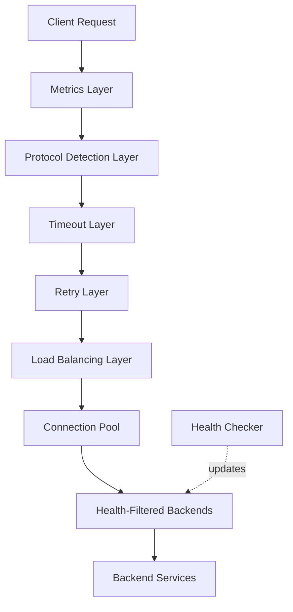

# gRPC-Aware Load Balancer Tower Stack Design

**Estimated reading time: ~1 hour**

## Overview

This document outlines the design for a comprehensive Tower stack implementing a gRPC-aware load balancer. The load balancer is designed to properly handle all gRPC streaming types, provide health checking capabilities, implement multiple load balancing strategies, and ensure connection affinity for streaming RPCs.

**Who should read this**: Developers building proxy infrastructure, service meshes, or API gateways that need to handle gRPC traffic.

**Prerequisites**: Familiarity with the Tower tutorial, especially the Service trait, Layers, and backpressure.

---

## gRPC Tutorial: Building a gRPC Service with Tonic and Tower

This section walks through building a complete gRPC service from scratch using [Tonic](https://github.com/hyperium/tonic)—the most popular gRPC library for Rust—and integrating Tower middleware for production readiness.

### What Is gRPC?

gRPC is a high-performance, open-source Remote Procedure Call (RPC) framework originally developed by Google. It uses:

- **Protocol Buffers (protobuf)** as the interface definition language and binary serialization format
- **HTTP/2** as the transport layer (multiplexed streams, header compression, bidirectional streaming)
- A **contract-first** approach: you define your API in a `.proto` schema, then generate server stubs and client code

Because gRPC services sit behind a Tonic server which itself is Tower-service-based, every Tower layer you have already learned applies directly to gRPC handlers.

```
Client ──HTTP/2──▶ Tonic Server
                    └─ Tower Stack (Timeout, Auth, Metrics…)
                         └─ Your gRPC handler (also a Service)
```

### Step 1 — Project Setup

Create a new Rust crate and add the required dependencies:

```toml
# Cargo.toml
[dependencies]
tonic      = "0.11"
prost      = "0.12"
tokio      = { version = "1", features = ["full"] }
tower      = { version = "0.4", features = ["full"] }
tower-http = { version = "0.5", features = ["trace", "timeout"] }
tracing    = "0.1"
tracing-subscriber = { version = "0.3", features = ["env-filter"] }

[build-dependencies]
tonic-build = "0.11"
```

Add a `build.rs` at the crate root to compile your proto files:

```rust
// build.rs
fn main() -> Result<(), Box<dyn std::error::Error>> {
    tonic_build::configure()
        .build_server(true)
        .build_client(true)
        .compile(
            &["proto/greeter.proto"],
            &["proto"],
        )?;
    Ok(())
}
```

### Step 2 — Define the Protobuf Schema

Create `proto/greeter.proto`:

```protobuf
syntax = "proto3";

package greeter;

// A simple greeter service with all four RPC patterns.
service Greeter {
  // Unary RPC
  rpc SayHello (HelloRequest) returns (HelloReply);

  // Server-streaming RPC
  rpc SayHelloStream (HelloRequest) returns (stream HelloReply);

  // Client-streaming RPC
  rpc CollectGreetings (stream HelloRequest) returns (HelloReply);

  // Bidirectional-streaming RPC
  rpc Chat (stream HelloRequest) returns (stream HelloReply);
}

message HelloRequest {
  string name    = 1;
  uint32 repeat  = 2; // used by streaming variants
}

message HelloReply {
  string message    = 1;
  uint64 timestamp  = 2; // Unix milliseconds
}
```

Run `cargo build` once to generate the Rust types under `target/` via `tonic-build`.

### Step 3 — Implement the gRPC Server

```rust
// src/server.rs
use std::time::{Duration, SystemTime, UNIX_EPOCH};
use tokio::sync::mpsc;
use tokio_stream::wrappers::ReceiverStream;
use tonic::{transport::Server, Request, Response, Status};

// Generated code from tonic-build
use greeter::greeter_server::{Greeter, GreeterServer};
use greeter::{HelloReply, HelloRequest};

pub mod greeter {
    tonic::include_proto!("greeter");
}

fn now_ms() -> u64 {
    SystemTime::now()
        .duration_since(UNIX_EPOCH)
        .unwrap_or_default()
        .as_millis() as u64
}

// ── Service implementation ────────────────────────────────────────────────────

#[derive(Debug, Default)]
pub struct GreeterService;

#[tonic::async_trait]
impl Greeter for GreeterService {
    // ── Unary ─────────────────────────────────────────────────────────────────
    async fn say_hello(
        &self,
        request: Request<HelloRequest>,
    ) -> Result<Response<HelloReply>, Status> {
        let name = &request.into_inner().name;
        Ok(Response::new(HelloReply {
            message: format!("Hello, {}!", name),
            timestamp: now_ms(),
        }))
    }

    // ── Server streaming ──────────────────────────────────────────────────────
    type SayHelloStreamStream = ReceiverStream<Result<HelloReply, Status>>;

    async fn say_hello_stream(
        &self,
        request: Request<HelloRequest>,
    ) -> Result<Response<Self::SayHelloStreamStream>, Status> {
        let inner = request.into_inner();
        let (tx, rx) = mpsc::channel(32);

        tokio::spawn(async move {
            for i in 0..inner.repeat.max(1) {
                let reply = HelloReply {
                    message: format!("Hello, {}! (message {})", inner.name, i + 1),
                    timestamp: now_ms(),
                };
                if tx.send(Ok(reply)).await.is_err() {
                    // Receiver dropped—client disconnected.
                    break;
                }
                tokio::time::sleep(Duration::from_millis(100)).await;
            }
        });

        Ok(Response::new(ReceiverStream::new(rx)))
    }

    // ── Client streaming ──────────────────────────────────────────────────────
    async fn collect_greetings(
        &self,
        request: Request<tonic::Streaming<HelloRequest>>,
    ) -> Result<Response<HelloReply>, Status> {
        let mut stream = request.into_inner();
        let mut names = Vec::new();

        while let Some(req) = stream.message().await? {
            names.push(req.name);
        }

        Ok(Response::new(HelloReply {
            message: format!("Hello to all: {}!", names.join(", ")),
            timestamp: now_ms(),
        }))
    }

    // ── Bidirectional streaming ───────────────────────────────────────────────
    type ChatStream = ReceiverStream<Result<HelloReply, Status>>;

    async fn chat(
        &self,
        request: Request<tonic::Streaming<HelloRequest>>,
    ) -> Result<Response<Self::ChatStream>, Status> {
        let mut inbound = request.into_inner();
        let (tx, rx) = mpsc::channel(32);

        tokio::spawn(async move {
            while let Some(Ok(req)) = inbound.message().await.transpose() {
                let reply = HelloReply {
                    message: format!("Echo: {}", req.name),
                    timestamp: now_ms(),
                };
                if tx.send(Ok(reply)).await.is_err() {
                    break;
                }
            }
        });

        Ok(Response::new(ReceiverStream::new(rx)))
    }
}
```

### Step 4 — Add Tower Middleware to the gRPC Server

Tonic's `Server::builder()` accepts a Tower `Layer` via `.layer()`. This is where you bolt on authentication, request tracing, timeouts, and any other middleware:

```rust
// src/main.rs
use std::net::SocketAddr;
use std::time::Duration;
use tonic::transport::Server;
use tower_http::{
    classify::{GrpcErrorsAsFailures, SharedClassifier},
    timeout::TimeoutLayer,
    trace::{DefaultMakeSpan, DefaultOnResponse, TraceLayer},
};
use tracing::Level;

mod server;
use server::{greeter::greeter_server::GreeterServer, GreeterService};

#[tokio::main]
async fn main() -> Result<(), Box<dyn std::error::Error>> {
    tracing_subscriber::fmt()
        .with_max_level(Level::DEBUG)
        .init();

    let addr: SocketAddr = "[::1]:50051".parse()?;
    tracing::info!("gRPC server listening on {}", addr);

    // ── Tower middleware stack ─────────────────────────────────────────────────
    let trace_layer = TraceLayer::new(SharedClassifier::new(GrpcErrorsAsFailures::new()))
        .make_span_with(DefaultMakeSpan::new().level(Level::INFO))
        .on_response(DefaultOnResponse::new().level(Level::INFO));

    let timeout_layer = TimeoutLayer::new(Duration::from_secs(30));

    Server::builder()
        .layer(trace_layer)   // Distributed tracing
        .layer(timeout_layer) // Per-RPC timeout
        .add_service(GreeterServer::new(GreeterService::default()))
        .serve(addr)
        .await?;

    Ok(())
}
```

### Step 5 — Implement a gRPC Client (also Tower-backed)

Tonic clients are Tower services too—you can wrap them with the same layers:

```rust
// src/client.rs
use std::time::Duration;
use tonic::transport::Channel;
use tower::ServiceBuilder;
use tower_http::timeout::TimeoutLayer;

use greeter::greeter_client::GreeterClient;
use greeter::HelloRequest;

pub mod greeter {
    tonic::include_proto!("greeter");
}

#[tokio::main]
async fn main() -> Result<(), Box<dyn std::error::Error>> {
    // Build a Tonic channel with a Tower middleware stack applied
    let channel = Channel::from_static("http://[::1]:50051")
        .connect()
        .await?;

    // Wrap the channel in Tower layers
    let channel = ServiceBuilder::new()
        .layer(TimeoutLayer::new(Duration::from_secs(5)))
        .service(channel);

    let mut client = GreeterClient::new(channel);

    // ── Unary call ────────────────────────────────────────────────────────────
    let response = client
        .say_hello(HelloRequest { name: "Tower".into(), repeat: 0 })
        .await?;
    println!("Unary response: {}", response.into_inner().message);

    // ── Server-streaming call ─────────────────────────────────────────────────
    let mut stream = client
        .say_hello_stream(HelloRequest { name: "Tower".into(), repeat: 5 })
        .await?
        .into_inner();

    while let Some(reply) = stream.message().await? {
        println!("Stream message: {}", reply.message);
    }

    Ok(())
}
```

### Step 6 — Adding Authentication Middleware

A common production requirement is bearer-token authentication. Implement it as a Tower Layer that intercepts each RPC:

```rust
use http::{Request, StatusCode};
use std::task::{Context, Poll};
use tower::{Layer, Service};

// ── The middleware service ────────────────────────────────────────────────────

#[derive(Clone)]
pub struct AuthService<S> {
    inner: S,
    secret: String,
}

impl<S, B> Service<Request<B>> for AuthService<S>
where
    S: Service<Request<B>, Response = http::Response<tonic::body::BoxBody>> + Clone + Send + 'static,
    S::Future: Send + 'static,
    B: Send + 'static,
{
    type Response = S::Response;
    type Error   = S::Error;
    type Future  = std::pin::Pin<
        Box<dyn std::future::Future<Output = Result<Self::Response, Self::Error>> + Send>,
    >;

    fn poll_ready(&mut self, cx: &mut Context<'_>) -> Poll<Result<(), Self::Error>> {
        self.inner.poll_ready(cx)
    }

    fn call(&mut self, request: Request<B>) -> Self::Future {
        let token = request
            .headers()
            .get("authorization")
            .and_then(|v| v.to_str().ok())
            .and_then(|s| s.strip_prefix("Bearer "))
            .map(str::to_owned);

        let authorized = token.as_deref() == Some(self.secret.as_str());

        if !authorized {
            return Box::pin(async move {
                // Return a gRPC UNAUTHENTICATED error
                let status = tonic::Status::unauthenticated("Invalid or missing token");
                Ok(status.to_http())
            });
        }

        let fut = self.inner.call(request);
        Box::pin(fut)
    }
}

// ── The layer ────────────────────────────────────────────────────────────────

#[derive(Clone)]
pub struct AuthLayer {
    secret: String,
}

impl AuthLayer {
    pub fn new(secret: impl Into<String>) -> Self {
        Self { secret: secret.into() }
    }
}

impl<S> Layer<S> for AuthLayer {
    type Service = AuthService<S>;

    fn layer(&self, inner: S) -> Self::Service {
        AuthService { inner, secret: self.secret.clone() }
    }
}
```

Add it to the server stack:

```rust
Server::builder()
    .layer(AuthLayer::new("my-secret-token"))
    .layer(trace_layer)
    .layer(timeout_layer)
    .add_service(GreeterServer::new(GreeterService::default()))
    .serve(addr)
    .await?;
```

### gRPC Tutorial Summary

| Step | What you learned |
|------|-----------------|
| 1 | Cargo setup with Tonic + Tower |
| 2 | Protobuf schema covering all four RPC patterns |
| 3 | Implementing unary, server-streaming, client-streaming, and bidi handlers |
| 4 | Attaching Tower layers (tracing, timeout) to a Tonic server |
| 5 | Building a Tower-wrapped Tonic client |
| 6 | Writing a custom auth middleware as a Tower `Layer` |

---

## Why gRPC Load Balancing is Different

Before diving into the design, let's understand why gRPC requires special treatment:

### HTTP/2 Multiplexing Complicates Things

gRPC runs over HTTP/2, which multiplexes many logical streams over a single TCP connection:

```
┌─────────────────────────────────────────────────────┐
│                  Single TCP Connection              │
├────────────┬────────────┬────────────┬─────────────┤
│  Stream 1  │  Stream 3  │  Stream 5  │  Stream 7   │
│  (Unary)   │ (Server)   │  (Bidi)    │  (Client)   │
│            │  Streaming │  Streaming │  Streaming  │
└────────────┴────────────┴────────────┴─────────────┘
```

This means:
1. **Connection != Request**: Opening a connection doesn't mean one request; many RPCs share a connection
2. **Per-stream state**: Each stream within a connection has its own lifecycle
3. **Head-of-line blocking in streams**: Each stream is ordered, but streams are independent
4. **Connection-level flow control**: HTTP/2 has connection and stream level flow control that must be respected

### Streaming Changes Everything

Unlike HTTP/1.1 where request→response is atomic, gRPC has four patterns:

| Pattern | Request | Response | Affinity Requirement |
|---------|---------|----------|----------------------|
| Unary | 1 message | 1 message | None—can load balance per-call |
| Server streaming | 1 message | N messages | Must route all responses from same backend |
| Client streaming | N messages | 1 message | Must route all client messages to same backend |
| Bidirectional | N messages | M messages | Full stream affinity required |

**Key insight**: For streaming RPCs, you're not load balancing individual messages—you're load balancing *stream establishment*.

### Health Checking is Protocol-Specific

gRPC has its own health checking protocol (grpc.health.v1.Health), separate from HTTP health endpoints. A backend might be healthy for HTTP but have a failing gRPC service.

## Core Components

The architecture is organized as a Tower layer stack. Understanding the ordering is crucial:



### Layer Ordering Rationale

The order matters for correctness and efficiency:

1. **Metrics** (outermost): Captures all requests, including those rejected by later layers
2. **Protocol Detection**: Early detection allows later layers to behave differently for gRPC vs HTTP
3. **Timeout**: Applied before retry so total time (including retries) is bounded
4. **Retry**: Before load balancing so retries can choose different backends
5. **Load Balancing**: Selects backends, manages stream affinity
6. **Connection Pool**: Manages HTTP/2 connections, applies per-backend backpressure  
7. **Health Filtering**: Only routes to healthy backends

### 1. Protocol Detection Layer

Identifies gRPC traffic and streaming type:

- Detects gRPC requests via `content-type: application/grpc`
- Determines streaming type from gRPC service definitions or message framing
- Attaches protocol metadata to request extensions
- Handles gRPC-Web transcoding if needed

**Why this is separate**: Downstream layers need this information to make decisions. Putting detection in its own layer makes the information available to all subsequent layers.

### 2. Timeout Layer

Protocol-aware timeout handling:

- **Unary RPCs**: Standard request timeout
- **Streaming RPCs**: Per-message timeout + overall stream timeout
- **Deadline propagation**: Forwards gRPC deadlines to backends via `grpc-timeout` header
- **Cancellation**: Properly cancels the HTTP/2 stream on timeout

**Critical detail**: For streaming, you need two timeouts—one for "no message received in X seconds" and one for "total stream duration".

### 3. Retry Layer

Intelligent retry with gRPC awareness:

- **Retryable status codes**: UNAVAILABLE, RESOURCE_EXHAUSTED (with backoff), ABORTED (for idempotent)
- **Non-retryable**: INVALID_ARGUMENT, NOT_FOUND, ALREADY_EXISTS, etc.
- **Streaming limitation**: Only retry before stream establishment—once streaming begins, retries are impossible
- **Retry budgets**: Limit total retries to prevent cascading failures

### 4. Load Balancing Layer

Backend selection with stream affinity:

- Multiple strategies (round-robin, least-connections, weighted)
- **Stream affinity tracking**: Maps HTTP/2 stream IDs to backends
- **Backend weight adjustment**: Based on health, latency, and active streams
- **Subsetting**: For large backend pools, each proxy instance uses a subset

### 5. Connection Pool

HTTP/2 connection management:

- **Multiplexing awareness**: One connection handles many streams
- **Connection lifecycle**: Handles GOAWAY, reconnection, connection draining
- **Per-connection backpressure**: `poll_ready` returns Pending when connection is saturated
- **Connection warmup**: Pre-establishes connections before routing traffic

### 6. Health Checking Layer

Proactive health verification:

- Implements gRPC Health Checking Protocol (grpc.health.v1.Health)
- Separate health state from load balancing decisions
- Configurable check intervals and timeouts
- Circuit breaking integration

## Detailed Component Design

### Protocol Detection Layer

```rust
use http::{Request, header::CONTENT_TYPE};

/// Detected protocol and streaming type
#[derive(Clone, Debug, PartialEq)]
pub enum Protocol {
    Http,
    GrpcUnary,
    GrpcServerStreaming,
    GrpcClientStreaming,
    GrpcBidirectional,
}

impl Protocol {
    /// Detect protocol from request headers
    pub fn detect<B>(req: &Request<B>) -> Self {
        let content_type = req.headers()
            .get(CONTENT_TYPE)
            .and_then(|v| v.to_str().ok())
            .unwrap_or("");
        
        if !content_type.starts_with("application/grpc") {
            return Protocol::Http;
        }
        
        // For actual streaming detection, you'd need service definitions
        // or inspect the gRPC message framing. Here's a simplified version
        // using a custom header that the client could set:
        match req.headers().get("x-grpc-streaming-type")
            .and_then(|v| v.to_str().ok())
        {
            Some("server") => Protocol::GrpcServerStreaming,
            Some("client") => Protocol::GrpcClientStreaming,
            Some("bidi") => Protocol::GrpcBidirectional,
            _ => Protocol::GrpcUnary, // Default assumption
        }
    }
    
    /// Does this protocol require stream affinity?
    pub fn requires_affinity(&self) -> bool {
        matches!(self, 
            Protocol::GrpcServerStreaming | 
            Protocol::GrpcClientStreaming | 
            Protocol::GrpcBidirectional
        )
    }
}

/// The protocol detection service
pub struct GrpcProtocolDetection<S> {
    inner: S,
}

impl<S> tower::Layer<S> for GrpcProtocolDetectionLayer {
    type Service = GrpcProtocolDetection<S>;

    fn layer(&self, service: S) -> Self::Service {
        GrpcProtocolDetection { inner: service }
    }
}
```

**Design note**: In a real implementation, streaming type detection is tricky. Options include:
1. Reflection on service definitions (requires proto files)
2. Client-provided hints via headers
3. Treating all gRPC as potentially streaming (conservative)

### Stream Affinity for Streaming RPCs

Stream affinity ensures all messages in a stream go to the same backend. The key insight is that affinity is tracked at the **HTTP/2 stream level**, not the gRPC message level.

```rust
use std::collections::HashMap;
use std::sync::{Arc, RwLock};

/// Identifies an HTTP/2 stream within a connection
#[derive(Clone, Copy, Debug, PartialEq, Eq, Hash)]
pub struct StreamId(u32);

/// Identifies a backend server
#[derive(Clone, Copy, Debug, PartialEq, Eq, Hash)]
pub struct BackendId(usize);

/// Tracks stream-to-backend affinity
/// 
/// This is shared across all service instances (hence Arc<RwLock<...>>)
pub struct StreamAffinityMap {
    inner: Arc<RwLock<AffinityState>>,
}

struct AffinityState {
    /// Maps client stream IDs to assigned backends
    stream_to_backend: HashMap<StreamId, BackendId>,
    /// Tracks active stream count per backend (for load info)
    backend_stream_count: HashMap<BackendId, usize>,
}

impl StreamAffinityMap {
    pub fn new() -> Self {
        Self {
            inner: Arc::new(RwLock::new(AffinityState {
                stream_to_backend: HashMap::new(),
                backend_stream_count: HashMap::new(),
            }))
        }
    }
    
    /// Get the backend for an existing stream, if any
    pub fn get_backend(&self, stream_id: StreamId) -> Option<BackendId> {
        self.inner.read().unwrap().stream_to_backend.get(&stream_id).copied()
    }
    
    /// Assign a stream to a backend
    pub fn set_affinity(&self, stream_id: StreamId, backend_id: BackendId) {
        let mut state = self.inner.write().unwrap();
        state.stream_to_backend.insert(stream_id, backend_id);
        *state.backend_stream_count.entry(backend_id).or_insert(0) += 1;
    }
    
    /// Remove affinity when stream ends
    pub fn remove_affinity(&self, stream_id: StreamId) {
        let mut state = self.inner.write().unwrap();
        if let Some(backend_id) = state.stream_to_backend.remove(&stream_id) {
            if let Some(count) = state.backend_stream_count.get_mut(&backend_id) {
                *count = count.saturating_sub(1);
            }
        }
    }
    
    /// Get backend with fewest active streams (for new stream assignment)
    pub fn least_loaded_backend(&self, backends: &[BackendId]) -> Option<BackendId> {
        let state = self.inner.read().unwrap();
        backends.iter()
            .min_by_key(|id| state.backend_stream_count.get(id).unwrap_or(&0))
            .copied()
    }
}
```

**Critical consideration**: Stream IDs are connection-scoped. If the client opens a new connection, stream ID 1 on the new connection is different from stream ID 1 on the old connection. You need to track (connection_id, stream_id) pairs, or use a higher-level correlation ID.
```

### Load Balancing Strategies

The load balancer supports multiple strategies through a trait:

```rust
use http::{Request, Response};
use bytes::Bytes;

/// Trait for load balancing algorithms
pub trait LoadBalancingStrategy: Send + Sync {
    /// Select a backend for a new request/stream
    /// Returns None if no backends are available
    fn select_backend(
        &self, 
        request: &Request<Bytes>, 
        protocol: &Protocol,
        affinity: &StreamAffinityMap,
    ) -> Option<BackendId>;
    
    /// Report the result of a request (for adaptive algorithms)
    fn report_result(
        &self, 
        backend: BackendId, 
        latency: std::time::Duration,
        success: bool,
    );
    
    /// Update backend weights (e.g., from health checker)
    fn update_weights(&self, weights: &HashMap<BackendId, f64>);
}
```

#### Round-Robin Strategy

Simple and predictable. Good for homogeneous backends:

```rust
use std::sync::atomic::{AtomicUsize, Ordering};

pub struct RoundRobinStrategy {
    backends: Vec<BackendId>,
    next: AtomicUsize,
}

impl LoadBalancingStrategy for RoundRobinStrategy {
    fn select_backend(
        &self,
        request: &Request<Bytes>,
        protocol: &Protocol,
        affinity: &StreamAffinityMap,
    ) -> Option<BackendId> {
        // For streaming, check existing affinity first
        if protocol.requires_affinity() {
            if let Some(stream_id) = extract_stream_id(request) {
                if let Some(backend) = affinity.get_backend(stream_id) {
                    return Some(backend);
                }
            }
        }
        
        // Round-robin selection
        if self.backends.is_empty() {
            return None;
        }
        
        let idx = self.next.fetch_add(1, Ordering::Relaxed) % self.backends.len();
        Some(self.backends[idx])
    }
    
    fn report_result(&self, _: BackendId, _: Duration, _: bool) {
        // Round-robin doesn't adapt based on results
    }
    
    fn update_weights(&self, _: &HashMap<BackendId, f64>) {
        // Round-robin ignores weights
    }
}
```

#### Least-Connections Strategy

Routes to the backend with fewest active requests. Better for heterogeneous backends or variable request costs:

```rust
pub struct LeastConnectionsStrategy {
    backends: Vec<BackendId>,
    active_connections: Arc<RwLock<HashMap<BackendId, usize>>>,
}

impl LoadBalancingStrategy for LeastConnectionsStrategy {
    fn select_backend(
        &self,
        request: &Request<Bytes>,
        protocol: &Protocol,
        affinity: &StreamAffinityMap,
    ) -> Option<BackendId> {
        // Check existing affinity for streaming
        if protocol.requires_affinity() {
            if let Some(stream_id) = extract_stream_id(request) {
                if let Some(backend) = affinity.get_backend(stream_id) {
                    return Some(backend);
                }
            }
        }
        
        // Select backend with fewest connections
        let counts = self.active_connections.read().unwrap();
        self.backends.iter()
            .min_by_key(|id| counts.get(id).unwrap_or(&0))
            .copied()
    }
    
    fn report_result(&self, backend: BackendId, _: Duration, _: bool) {
        // Connection tracking is handled separately
    }
    
    fn update_weights(&self, _: &HashMap<BackendId, f64>) {
        // Could incorporate weights as multipliers
    }
}
```

#### Power of Two Choices (P2C)

P2C randomly selects two backends and picks the one with fewer connections. Provides good load distribution with O(1) selection:

```rust
use rand::Rng;

pub struct P2CStrategy {
    backends: Vec<BackendId>,
    active_connections: Arc<RwLock<HashMap<BackendId, usize>>>,
}

impl LoadBalancingStrategy for P2CStrategy {
    fn select_backend(
        &self,
        request: &Request<Bytes>,
        protocol: &Protocol,
        affinity: &StreamAffinityMap,
    ) -> Option<BackendId> {
        // Affinity check for streaming
        if protocol.requires_affinity() {
            if let Some(stream_id) = extract_stream_id(request) {
                if let Some(backend) = affinity.get_backend(stream_id) {
                    return Some(backend);
                }
            }
        }
        
        let n = self.backends.len();
        if n == 0 { return None; }
        if n == 1 { return Some(self.backends[0]); }
        
        // Pick two random backends
        let mut rng = rand::thread_rng();
        let i = rng.gen_range(0..n);
        let j = (i + rng.gen_range(1..n)) % n;
        
        let counts = self.active_connections.read().unwrap();
        let count_i = counts.get(&self.backends[i]).unwrap_or(&0);
        let count_j = counts.get(&self.backends[j]).unwrap_or(&0);
        
        Some(if count_i <= count_j { 
            self.backends[i] 
        } else { 
            self.backends[j] 
        })
    }
    
    // ... other methods
}
```

**Which to choose?**
- Round-robin: Simple, predictable, good for similar backends
- Least-connections: Better for varying request costs
- P2C: Good balance of simplicity and load awareness
```

### Health Checking Integration

The health checker runs as a background task, updating shared health state:

```rust
use std::time::Duration;
use tokio::sync::watch;

/// Health status of a backend
#[derive(Clone, Copy, Debug, PartialEq)]
pub enum HealthStatus {
    Healthy,
    Degraded,  // Serving but slow
    Unhealthy,
}

/// Configuration for health checking
pub struct HealthCheckConfig {
    /// How often to check each backend
    pub check_interval: Duration,
    /// Timeout for individual health checks
    pub check_timeout: Duration,
    /// Failures before marking unhealthy
    pub unhealthy_threshold: u32,
    /// Successes before marking healthy again
    pub healthy_threshold: u32,
}

/// The health checker runs in the background
pub struct HealthChecker {
    config: HealthCheckConfig,
    /// Send health updates to subscribers
    health_tx: watch::Sender<HashMap<BackendId, HealthStatus>>,
}

impl HealthChecker {
    /// Start the health checker as a background task
    pub fn spawn(
        backends: Vec<(BackendId, String)>, // (id, address)
        config: HealthCheckConfig,
    ) -> watch::Receiver<HashMap<BackendId, HealthStatus>> {
        let (tx, rx) = watch::channel(HashMap::new());
        
        tokio::spawn(async move {
            let mut health_state: HashMap<BackendId, (HealthStatus, u32)> = backends.iter()
                .map(|(id, _)| (*id, (HealthStatus::Healthy, 0)))
                .collect();
            
            loop {
                for (backend_id, addr) in &backends {
                    let result = Self::check_backend(addr, config.check_timeout).await;
                    
                    let (status, count) = health_state.get_mut(backend_id).unwrap();
                    
                    match result {
                        Ok(()) => {
                            *count = count.saturating_add(1);
                            if *count >= config.healthy_threshold {
                                *status = HealthStatus::Healthy;
                            }
                        }
                        Err(_) => {
                            *count = 0;
                            // Increment failure count (tracked separately in real impl)
                            *status = HealthStatus::Unhealthy;
                        }
                    }
                }
                
                // Publish updates
                let current: HashMap<_, _> = health_state.iter()
                    .map(|(id, (status, _))| (*id, *status))
                    .collect();
                let _ = tx.send(current);
                
                tokio::time::sleep(config.check_interval).await;
            }
        });
        
        rx
    }
    
    /// Perform a gRPC health check
    async fn check_backend(addr: &str, timeout: Duration) -> Result<(), Box<dyn std::error::Error>> {
        // In a real implementation, this would:
        // 1. Create a gRPC client to addr
        // 2. Call grpc.health.v1.Health/Check
        // 3. Return Ok if status is SERVING
        
        // Simplified example:
        tokio::time::timeout(timeout, async {
            // let mut client = HealthClient::connect(addr).await?;
            // let response = client.check(HealthCheckRequest { service: "".into() }).await?;
            // if response.status == ServingStatus::Serving { Ok(()) } else { Err(...) }
            Ok(())
        }).await?
    }
}
```

The health checker:
1. Periodically sends health check requests to all backends
2. Updates the health status map
3. Removes unhealthy backends from the load balancing pool
4. Re-enables backends when they become healthy again

## Error Handling

gRPC has specific error semantics that the load balancer must respect:

### gRPC Status Code Mapping

```rust
/// Map transport/HTTP errors to gRPC status codes
fn map_to_grpc_status(error: &LoadBalancerError) -> tonic::Code {
    match error {
        LoadBalancerError::NoBackendsAvailable => tonic::Code::Unavailable,
        LoadBalancerError::AllBackendsUnhealthy => tonic::Code::Unavailable,
        LoadBalancerError::Timeout => tonic::Code::DeadlineExceeded,
        LoadBalancerError::ConnectionFailed(_) => tonic::Code::Unavailable,
        LoadBalancerError::BackendError(code) => *code, // Pass through
        LoadBalancerError::InvalidRequest(_) => tonic::Code::InvalidArgument,
    }
}

/// Determine if an error is retryable
fn is_retryable(status: tonic::Code) -> bool {
    matches!(status, 
        tonic::Code::Unavailable |      // Backend temporarily unavailable
        tonic::Code::ResourceExhausted | // Rate limited (with backoff)
        tonic::Code::Aborted            // For idempotent operations
    )
}
```

### Streaming Error Handling

Errors during streaming require special handling:

1. **Pre-stream errors**: Normal retry applies
2. **Mid-stream errors**: Cannot retry—must propagate to client
3. **Backend disconnect**: Send RST_STREAM to client, clean up affinity

```rust
/// Handle errors in streaming context
async fn handle_stream_error(
    stream_id: StreamId,
    affinity: &StreamAffinityMap,
    error: LoadBalancerError,
) -> tonic::Status {
    // Clean up stream affinity
    affinity.remove_affinity(stream_id);
    
    // Convert to gRPC status
    let code = map_to_grpc_status(&error);
    tonic::Status::new(code, error.to_string())
}
```

### Circuit Breaking Integration

To prevent cascading failures, integrate circuit breakers per-backend:

```rust
/// Circuit breaker states
#[derive(Clone, Copy, Debug)]
pub enum CircuitState {
    Closed,     // Normal operation
    Open,       // Fast-failing
    HalfOpen,   // Testing recovery
}

pub struct CircuitBreaker {
    state: CircuitState,
    failure_count: u32,
    success_count: u32,
    last_failure: Option<Instant>,
    config: CircuitConfig,
}

impl CircuitBreaker {
    /// Should we allow a request through?
    pub fn should_allow(&mut self) -> bool {
        match self.state {
            CircuitState::Closed => true,
            CircuitState::Open => {
                // Check if enough time has passed to try again
                if let Some(last) = self.last_failure {
                    if last.elapsed() > self.config.reset_timeout {
                        self.state = CircuitState::HalfOpen;
                        self.success_count = 0;
                        return true;
                    }
                }
                false
            }
            CircuitState::HalfOpen => true, // Allow test requests
        }
    }
    
    /// Record a request result
    pub fn record_result(&mut self, success: bool) {
        match (self.state, success) {
            (CircuitState::Closed, false) => {
                self.failure_count += 1;
                if self.failure_count >= self.config.failure_threshold {
                    self.state = CircuitState::Open;
                    self.last_failure = Some(Instant::now());
                }
            }
            (CircuitState::HalfOpen, true) => {
                self.success_count += 1;
                if self.success_count >= self.config.success_threshold {
                    self.state = CircuitState::Closed;
                    self.failure_count = 0;
                }
            }
            (CircuitState::HalfOpen, false) => {
                self.state = CircuitState::Open;
                self.last_failure = Some(Instant::now());
            }
            _ => {}
        }
    }
}
```

## Implementation Considerations

### 1. Backpressure Propagation

Every layer must correctly implement `poll_ready`. The load balancer's `poll_ready` is particularly important:

```rust
fn poll_ready(&mut self, cx: &mut Context<'_>) -> Poll<Result<(), Self::Error>> {
    // WRONG: Checking if ANY backend is ready
    // if self.backends.iter_mut().any(|b| b.poll_ready(cx).is_ready()) { ... }
    
    // CORRECT: We need at least one HEALTHY backend to be ready
    // The selected backend in call() must be the one that was ready
    
    let healthy_backends: Vec<_> = self.backends.iter()
        .enumerate()
        .filter(|(i, _)| self.is_healthy(BackendId(*i)))
        .collect();
    
    if healthy_backends.is_empty() {
        return Poll::Ready(Err(LoadBalancerError::AllBackendsUnhealthy));
    }
    
    // Check readiness of healthy backends
    for (idx, backend) in healthy_backends {
        if let Poll::Ready(Ok(())) = backend.poll_ready(cx) {
            self.ready_backend = Some(BackendId(idx));
            return Poll::Ready(Ok(()));
        }
    }
    
    Poll::Pending
}
```

**Key insight**: The backend selected in `poll_ready` should be used in the subsequent `call()`. Otherwise, you might select a backend in `call()` that wasn't actually ready.

### 2. HTTP/2 Connection Management

HTTP/2 multiplexes streams over connections. Consider:

- **GOAWAY handling**: Backend sends GOAWAY when draining. Stop sending new streams, let existing streams complete.
- **MAX_CONCURRENT_STREAMS**: Respect the backend's limit. If exceeded, queue or apply backpressure.
- **Connection lifecycle**: Long-lived connections may need periodic refresh.

```rust
/// Connection state tracking
pub struct Http2Connection {
    /// The underlying connection
    sender: hyper::client::conn::http2::SendRequest<Bytes>,
    /// Max streams allowed (from SETTINGS)
    max_streams: u32,
    /// Current active streams
    active_streams: u32,
    /// Is this connection draining (received GOAWAY)?
    draining: bool,
}

impl Http2Connection {
    fn can_accept_stream(&self) -> bool {
        !self.draining && self.active_streams < self.max_streams
    }
}
```

### 3. Cancellation Handling

gRPC cancellation must propagate correctly:

```rust
// When client cancels (sends RST_STREAM):
// 1. Cancel the backend request
// 2. Clean up stream affinity
// 3. Decrement active connection counts

async fn handle_request<B>(
    request: Request<B>,
    backend: &mut BackendService,
    affinity: &StreamAffinityMap,
) -> Result<Response<B>, Error> {
    let stream_id = extract_stream_id(&request);
    
    // Use tokio::select! to handle cancellation
    tokio::select! {
        result = backend.call(request) => {
            if let Some(id) = stream_id {
                affinity.remove_affinity(id);
            }
            result
        }
        _ = client_cancelled() => {
            if let Some(id) = stream_id {
                affinity.remove_affinity(id);
            }
            Err(Error::Cancelled)
        }
    }
}
```

### 4. Metrics and Observability

Instrument key points for debugging and monitoring:

```rust
use metrics::{counter, histogram, gauge};

/// Record metrics for a request
fn record_request_metrics(
    protocol: &Protocol,
    backend: BackendId,
    latency: Duration,
    status: tonic::Code,
) {
    // Request counters
    counter!("grpc_requests_total", 
        "protocol" => protocol.as_str(),
        "backend" => backend.0.to_string(),
        "status" => status.as_str()
    ).increment(1);
    
    // Latency histogram
    histogram!("grpc_request_duration_seconds",
        "protocol" => protocol.as_str(),
        "backend" => backend.0.to_string()
    ).record(latency.as_secs_f64());
}

/// Record active stream gauge
fn record_stream_metrics(affinity: &StreamAffinityMap) {
    let state = affinity.inner.read().unwrap();
    for (backend, count) in &state.backend_stream_count {
        gauge!("grpc_active_streams", 
            "backend" => backend.0.to_string()
        ).set(*count as f64);
    }
}
```

## Tower Service Implementation

The core service implementation follows Tower's `Service` trait. Note the careful handling of `poll_ready`:

```rust
use std::future::Future;
use std::pin::Pin;
use std::task::{Context, Poll};
use tower::Service;
use bytes::Bytes;
use http::{Request, Response};

pub struct GrpcLoadBalancer<S> {
    backends: Vec<S>,
    strategy: Box<dyn LoadBalancingStrategy>,
    affinity: StreamAffinityMap,
    health_rx: watch::Receiver<HashMap<BackendId, HealthStatus>>,
    /// The backend that poll_ready determined was ready
    ready_backend: Option<BackendId>,
}

impl<S, B> Service<Request<B>> for GrpcLoadBalancer<S>
where
    S: Service<Request<B>, Response = Response<Bytes>> + Clone + Send + 'static,
    S::Error: Into<Box<dyn std::error::Error + Send + Sync>>,
    S::Future: Send,
    B: http_body::Body + Send + 'static,
{
    type Response = Response<Bytes>;
    type Error = Box<dyn std::error::Error + Send + Sync>;
    type Future = Pin<Box<dyn Future<Output = Result<Self::Response, Self::Error>> + Send>>;

    fn poll_ready(&mut self, cx: &mut Context<'_>) -> Poll<Result<(), Self::Error>> {
        // Get current health status
        let health = self.health_rx.borrow();
        
        // Find healthy backends
        let healthy_indices: Vec<usize> = self.backends.iter()
            .enumerate()
            .filter(|(i, _)| {
                health.get(&BackendId(*i))
                    .map(|s| *s == HealthStatus::Healthy)
                    .unwrap_or(true) // Default to healthy if unknown
            })
            .map(|(i, _)| i)
            .collect();
        
        if healthy_indices.is_empty() {
            return Poll::Ready(Err("No healthy backends available".into()));
        }
        
        // Poll each healthy backend until we find one that's ready
        for idx in healthy_indices {
            match self.backends[idx].poll_ready(cx) {
                Poll::Ready(Ok(())) => {
                    // Found a ready backend - remember it for call()
                    self.ready_backend = Some(BackendId(idx));
                    return Poll::Ready(Ok(()));
                }
                Poll::Ready(Err(e)) => {
                    // This backend failed, try next
                    continue;
                }
                Poll::Pending => {
                    // Not ready yet, continue checking others
                    continue;
                }
            }
        }
        
        // No backends are ready right now
        Poll::Pending
    }

    fn call(&mut self, request: Request<B>) -> Self::Future {
        // Detect protocol
        let protocol = Protocol::detect(&request);
        
        // Select backend
        let backend_id = if protocol.requires_affinity() {
            // Check for existing stream affinity
            if let Some(stream_id) = extract_stream_id(&request) {
                if let Some(existing) = self.affinity.get_backend(stream_id) {
                    existing
                } else {
                    // New stream - use strategy to select, then record affinity
                    let selected = self.strategy.select_backend(&request, &protocol, &self.affinity)
                        .or(self.ready_backend)
                        .expect("poll_ready should ensure a backend is available");
                    self.affinity.set_affinity(stream_id, selected);
                    selected
                }
            } else {
                // No stream ID (shouldn't happen for streaming), fall back
                self.ready_backend.expect("poll_ready should set ready_backend")
            }
        } else {
            // Unary RPC - can use any selection strategy
            self.strategy.select_backend(&request, &protocol, &self.affinity)
                .or(self.ready_backend)
                .expect("poll_ready should ensure a backend is available")
        };
        
        // Clone the backend service
        let mut backend = self.backends[backend_id.0].clone();
        let affinity = self.affinity.clone();
        let strategy = self.strategy.clone(); // Assuming Clone is implemented
        
        // Clear ready_backend - must call poll_ready again before next call
        self.ready_backend = None;
        
        Box::pin(async move {
            let start = std::time::Instant::now();
            
            // Call the backend
            let result = backend.call(request).await.map_err(Into::into);
            
            // Report result for adaptive strategies
            let latency = start.elapsed();
            let success = result.is_ok();
            strategy.report_result(backend_id, latency, success);
            
            // Clean up affinity for completed streams
            // (In practice, this would be more sophisticated)
            
            result
        })
    }
}
```

**Important notes:**
1. We track `ready_backend` to ensure `call()` uses a backend that `poll_ready()` confirmed was ready
2. For streaming with affinity, we might use a different backend than `ready_backend`—this is a trade-off between affinity and backpressure
3. Clone the backend service to avoid holding a mutable borrow across await points
```

## Complete Tower Stack Assembly

Here's how to assemble all the layers into a working load balancer:

```rust
use std::time::Duration;
use tower::{ServiceBuilder, ServiceExt};

/// Configuration for the load balancer
#[derive(Clone)]
pub struct LoadBalancerConfig {
    /// Load balancing strategy
    pub strategy: StrategyType,
    /// Request timeout for unary RPCs
    pub request_timeout: Duration,
    /// Maximum retries for failed requests
    pub max_retries: u32,
    /// Base retry interval (exponential backoff applied)
    pub retry_base_interval: Duration,
    /// Health check configuration
    pub health_check: HealthCheckConfig,
}

#[derive(Clone)]
pub enum StrategyType {
    RoundRobin,
    LeastConnections,
    PowerOfTwoChoices,
}

/// Build the complete load balancer service
pub fn build_load_balancer<S>(
    backends: Vec<(BackendId, S, String)>, // (id, service, address)
    config: LoadBalancerConfig,
) -> impl Service<
    Request<bytes::Bytes>,
    Response = Response<bytes::Bytes>,
    Error = Box<dyn std::error::Error + Send + Sync>,
>
where
    S: Service<Request<bytes::Bytes>, Response = Response<bytes::Bytes>>
        + Clone + Send + 'static,
    S::Error: Into<Box<dyn std::error::Error + Send + Sync>>,
    S::Future: Send,
{
    // Start the health checker (runs in background)
    let backend_addrs: Vec<_> = backends.iter()
        .map(|(id, _, addr)| (*id, addr.clone()))
        .collect();
    let health_rx = HealthChecker::spawn(backend_addrs, config.health_check.clone());
    
    // Create the load balancing strategy
    let backend_ids: Vec<_> = backends.iter().map(|(id, _, _)| *id).collect();
    let strategy: Box<dyn LoadBalancingStrategy> = match config.strategy {
        StrategyType::RoundRobin => 
            Box::new(RoundRobinStrategy::new(backend_ids.clone())),
        StrategyType::LeastConnections => 
            Box::new(LeastConnectionsStrategy::new(backend_ids.clone())),
        StrategyType::PowerOfTwoChoices => 
            Box::new(P2CStrategy::new(backend_ids.clone())),
    };
    
    // Create stream affinity tracker
    let affinity = StreamAffinityMap::new();
    
    // Extract just the services
    let backend_services: Vec<_> = backends.into_iter()
        .map(|(_, svc, _)| svc)
        .collect();
    
    // Create the core load balancer
    let load_balancer = GrpcLoadBalancer {
        backends: backend_services,
        strategy,
        affinity,
        health_rx,
        ready_backend: None,
    };
    
    // Build the complete stack with layers
    ServiceBuilder::new()
        // Metrics collection (outermost)
        .layer(MetricsLayer::new())
        // Protocol detection (early, needed by other layers)
        .layer(GrpcProtocolDetectionLayer::new())
        // Overall timeout
        .layer(TimeoutLayer::new(config.request_timeout))
        // Retry with gRPC awareness (retries happen before load balancing)
        .layer(GrpcRetryLayer::new(
            config.max_retries,
            config.retry_base_interval,
        ))
        // The load balancer itself
        .service(load_balancer)
}
```

## Usage Example

Here's how to use the load balancer in a real application:

```rust
use hyper::{Body, Server};
use std::net::SocketAddr;

#[tokio::main]
async fn main() -> Result<(), Box<dyn std::error::Error>> {
    // Initialize tracing
    tracing_subscriber::fmt::init();
    
    // Define backend addresses
    let backend_addrs = vec![
        "http://backend1.example.com:50051",
        "http://backend2.example.com:50051",
        "http://backend3.example.com:50051",
    ];
    
    // Create HTTP/2 clients for each backend
    let backends: Vec<_> = backend_addrs.iter()
        .enumerate()
        .map(|(idx, addr)| {
            let addr = addr.to_string();
            let client = hyper::Client::builder()
                .http2_only(true)  // gRPC requires HTTP/2
                .build_http();
            
            // Create a service that forwards to this backend
            let svc = tower::service_fn(move |mut req: Request<bytes::Bytes>| {
                let client = client.clone();
                let addr = addr.clone();
                async move {
                    // Rewrite URI to target backend
                    let path = req.uri().path_and_query()
                        .map(|pq| pq.as_str())
                        .unwrap_or("/");
                    let uri = format!("{}{}", addr, path);
                    *req.uri_mut() = uri.parse()?;
                    
                    // Forward the request
                    client.request(req).await
                        .map_err(|e| Box::new(e) as Box<dyn std::error::Error + Send + Sync>)
                }
            });
            
            (BackendId(idx), svc, addr.to_string())
        })
        .collect();
    
    // Configure the load balancer
    let config = LoadBalancerConfig {
        strategy: StrategyType::PowerOfTwoChoices,
        request_timeout: Duration::from_secs(30),
        max_retries: 3,
        retry_base_interval: Duration::from_millis(100),
        health_check: HealthCheckConfig {
            check_interval: Duration::from_secs(10),
            check_timeout: Duration::from_secs(2),
            unhealthy_threshold: 3,
            healthy_threshold: 2,
        },
    };
    
    // Build the load balancer
    let load_balancer = build_load_balancer(backends, config);
    
    // Start the server
    let addr: SocketAddr = "0.0.0.0:8080".parse()?;
    tracing::info!("gRPC load balancer listening on {}", addr);
    
    Server::bind(&addr)
        .http2_only(true)
        .serve(tower::make::Shared::new(load_balancer))
        .await?;
    
    Ok(())
}
```

## Key Design Decisions Summary

| Decision | Rationale |
|----------|-----------|
| Separate health checker task | Avoids blocking request path with health checks |
| `watch` channel for health | Efficient broadcast of health updates |
| Stream affinity in shared map | Multiple service instances need same affinity view |
| P2C as default strategy | Good balance of simplicity and load awareness |
| Clone backend services | Required for async borrow safety |
| `ready_backend` tracking | Ensures `call()` uses a truly ready backend |
| Layer ordering (metrics → detection → timeout → retry → LB) | Each position serves a purpose |

## High Performance gRPC with Tower

This section consolidates battle-tested techniques for squeezing maximum throughput and minimum latency out of a gRPC service built on the Tower stack.

### 1. Zero-Copy Message Passing with `Bytes`

Protobuf serialization typically heap-allocates each encoded message. Two strategies eliminate most of these allocations in data-plane critical paths:

**Strategy A — Pre-serialise and cache into `Bytes`**

```rust
use bytes::Bytes;
use prost::Message;

/// A cache of pre-encoded protobuf replies keyed by name length bucket.
/// Because `Bytes` is Arc<[u8]>-backed, cloning is O(1).
#[derive(Clone, Default)]
struct ReplyCache {
    entries: std::collections::HashMap<u32, Bytes>,
}

impl ReplyCache {
    fn get_or_insert(&mut self, req: &HelloRequest) -> Bytes {
        self.entries
            .entry(req.name.len() as u32)
            .or_insert_with(|| {
                let reply = HelloReply {
                    message: format!("Hello, {}!", req.name),
                    timestamp: 0,
                };
                let mut buf = bytes::BytesMut::with_capacity(reply.encoded_len());
                reply.encode(&mut buf).expect("encode cannot fail");
                buf.freeze()
            })
            .clone() // Arc clone — no data copy
    }
}
```

**Strategy B — Reuse encode buffers with `BytesMut`**

```rust
use bytes::BytesMut;
use prost::Message;

thread_local! {
    // One reusable encode buffer per Tokio worker thread.
    static ENCODE_BUF: std::cell::RefCell<BytesMut> =
        std::cell::RefCell::new(BytesMut::with_capacity(4096));
}

fn encode_reply(reply: &HelloReply) -> bytes::Bytes {
    ENCODE_BUF.with(|cell| {
        let mut buf = cell.borrow_mut();
        buf.clear();
        reply.encode(&mut *buf).expect("encode cannot fail");
        buf.clone().freeze()
    })
}
```

### 2. Connection Multiplexing — Tuning HTTP/2 Parameters

A single HTTP/2 connection can carry hundreds of concurrent streams, but the default hyper/h2 settings are conservative. Tune them to match your workload:

```rust
use hyper::client::conn::http2;
use std::time::Duration;

let (sender, conn) = http2::Builder::new(TokioExecutor::new())
    // Maximum concurrent streams per connection (gRPC default: 100)
    .max_concurrent_reset_streams(200)
    // Increase flow control windows for high-throughput streaming RPCs
    .initial_stream_window_size(4 * 1024 * 1024)   // 4 MiB per stream
    .initial_connection_window_size(8 * 1024 * 1024) // 8 MiB per connection
    // Keep-alive prevents idle connections from being torn down by NATs/LBs
    .keep_alive_interval(Duration::from_secs(20))
    .keep_alive_timeout(Duration::from_secs(5))
    .handshake(io)
    .await?;
```

Correspondingly on the server side with Tonic's `Server::builder()`:

```rust
Server::builder()
    .initial_stream_window_size(4 * 1024 * 1024)
    .initial_connection_window_size(8 * 1024 * 1024)
    .http2_keepalive_interval(Some(Duration::from_secs(20)))
    .http2_keepalive_timeout(Some(Duration::from_secs(5)))
    .concurrency_limit_per_connection(512) // Tower ConcurrencyLimit per conn
    .add_service(GreeterServer::new(GreeterService::default()))
    .serve(addr)
    .await?;
```

### 3. Avoiding Lock Contention on Hot Paths

Every `Arc<Mutex<…>>` in a hot request path is a potential serialisation point. Use lock-free or sharded structures instead:

```rust
use std::sync::atomic::{AtomicU64, Ordering};
use dashmap::DashMap; // sharded concurrent map

/// Per-backend statistics updated without taking a global lock.
pub struct BackendStats {
    pub active_streams: AtomicU64,
    pub total_requests: AtomicU64,
    pub error_count:    AtomicU64,
}

impl BackendStats {
    pub fn record_start(&self) {
        self.active_streams.fetch_add(1, Ordering::Relaxed);
        self.total_requests.fetch_add(1, Ordering::Relaxed);
    }

    pub fn record_end(&self, is_error: bool) {
        self.active_streams.fetch_sub(1, Ordering::Relaxed);
        if is_error {
            self.error_count.fetch_add(1, Ordering::Relaxed);
        }
    }

    pub fn error_rate(&self) -> f64 {
        let total = self.total_requests.load(Ordering::Relaxed);
        if total == 0 { return 0.0; }
        self.error_count.load(Ordering::Relaxed) as f64 / total as f64
    }
}

/// Sharded map: O(1) concurrent reads without lock contention.
pub struct AffinityTable {
    map: DashMap<u32, BackendId>, // stream_id → backend
}

impl AffinityTable {
    pub fn insert(&self, stream_id: u32, backend: BackendId) {
        self.map.insert(stream_id, backend);
    }

    pub fn lookup(&self, stream_id: u32) -> Option<BackendId> {
        self.map.get(&stream_id).map(|r| *r)
    }

    pub fn remove(&self, stream_id: u32) {
        self.map.remove(&stream_id);
    }
}
```

### 4. Named-Future Load Balancer (Zero Box::pin Overhead)

`Box::pin` allocates on every call. For a load balancer that is in the critical path of every RPC, use named future types via `pin-project` instead:

```rust
use pin_project::pin_project;
use std::future::Future;
use std::pin::Pin;
use std::task::{Context, Poll};

/// The future returned by `LoadBalancerService::call`.
/// No heap allocation — lives entirely on the stack / inline in the caller.
#[pin_project]
pub struct LoadBalancerFuture<F> {
    #[pin]
    inner: F,
    backend_id: BackendId,
    stats: std::sync::Arc<BackendStats>,
    started: bool,
}

impl<F, Res, Err> Future for LoadBalancerFuture<F>
where
    F: Future<Output = Result<Res, Err>>,
{
    type Output = Result<Res, Err>;

    fn poll(self: Pin<&mut Self>, cx: &mut Context<'_>) -> Poll<Self::Output> {
        let this = self.project();
        if !*this.started {
            this.stats.record_start();
            *this.started = true;
        }
        match this.inner.poll(cx) {
            Poll::Pending => Poll::Pending,
            Poll::Ready(result) => {
                let is_err = result.is_err();
                this.stats.record_end(is_err);
                Poll::Ready(result)
            }
        }
    }
}
```

### 5. Streaming Back-Pressure and Channel Sizing

When implementing server-streaming RPCs, the channel buffer size directly controls memory usage under back-pressure. Size it to match your SLA rather than using an arbitrary default:

```rust
/// Capacity formula:
///   buffer = target_throughput_msg_per_sec × acceptable_buffer_latency_sec
///
/// Example: 10 000 msg/s target, 10 ms acceptable buffering
///   buffer = 10 000 × 0.01 = 100 messages
const STREAM_CHANNEL_CAPACITY: usize = 100;

async fn say_hello_stream_high_perf(
    &self,
    request: Request<HelloRequest>,
) -> Result<Response<ReceiverStream<Result<HelloReply, Status>>>, Status> {
    let inner = request.into_inner();
    let (tx, rx) = mpsc::channel(STREAM_CHANNEL_CAPACITY);

    tokio::spawn(async move {
        for i in 0..inner.repeat.max(1) {
            let reply = HelloReply {
                message: format!("msg {}", i),
                timestamp: now_ms(),
            };
            // `send` blocks when the channel is full—this IS the back-pressure.
            // If you used `try_send` you'd drop messages instead.
            if tx.send(Ok(reply)).await.is_err() {
                break; // client disconnected
            }
        }
    });

    Ok(Response::new(ReceiverStream::new(rx)))
}
```

### 6. Batching Unary RPCs with Request Coalescing

For highly repetitive unary RPCs (e.g. cache lookups), coalescing in-flight identical requests reduces backend load:

```rust
use std::collections::HashMap;
use std::sync::{Arc, Mutex};
use tokio::sync::broadcast;

type CoalesceKey = String; // e.g. the user name

#[derive(Clone)]
pub struct CoalescingService<S> {
    inner: S,
    in_flight: Arc<Mutex<HashMap<CoalesceKey, broadcast::Sender<Arc<HelloReply>>>>>,
}

impl<S> CoalescingService<S> {
    pub fn new(inner: S) -> Self {
        Self {
            inner,
            in_flight: Arc::new(Mutex::new(HashMap::new())),
        }
    }
}

// The call implementation coalesces concurrent identical requests into one
// upstream call, then fans the response out to all waiters.
// (Full tower::Service impl omitted for brevity — the pattern is clear above.)
```

### 7. CPU-Core Pinning and Tokio Runtime Tuning

For latency-sensitive gRPC services, avoid work-stealing jitter by pinning Tokio workers to CPU cores:

```rust
fn build_runtime(worker_threads: usize) -> tokio::runtime::Runtime {
    tokio::runtime::Builder::new_multi_thread()
        .worker_threads(worker_threads)
        // Grow blocking pool quickly for any blocking gRPC interceptors
        .max_blocking_threads(64)
        // Reduce timer resolution for high-frequency timeout checks
        // (only available on Linux via timerfd)
        .enable_all()
        .on_thread_start(|| {
            // Optionally: set CPU affinity here via the `core_affinity` crate
            tracing::debug!("Worker thread started on {:?}", std::thread::current().id());
        })
        .build()
        .expect("failed to build Tokio runtime")
}
```

Pin workers to physical cores (not hyper-threads sharing a core) for best tail-latency:

```bash
# Example: 8-core machine, 8 workers, each on its own physical core
TOKIO_WORKER_THREADS=8 taskset -c 0-7 ./my_grpc_server
```

### 8. Benchmarking gRPC Services

Use `ghz` (a gRPC benchmarking tool) alongside Criterion for micro-benchmarks:

```bash
# Install ghz
go install github.com/bojand/ghz/cmd/ghz@latest

# Unary RPC benchmark: 100 000 requests, 50 concurrent
ghz --insecure \
    --proto proto/greeter.proto \
    --call greeter.Greeter.SayHello \
    --data '{"name": "bench", "repeat": 1}' \
    --total 100000 \
    --concurrency 50 \
    [::1]:50051
```

For Tower-layer micro-benchmarks in Criterion:

```rust
use criterion::{criterion_group, criterion_main, BenchmarkId, Criterion};
use tower::{Service, ServiceExt};

fn bench_grpc_stack(c: &mut Criterion) {
    let rt = tokio::runtime::Runtime::new().unwrap();
    let mut svc = rt.block_on(async {
        tower::ServiceBuilder::new()
            .layer(TimeoutLayer::new(Duration::from_secs(1)))
            .service(GreeterService::default())
    });

    c.bench_function("unary_hello", |b| {
        b.to_async(&rt).iter(|| async {
            let req = tonic::Request::new(HelloRequest {
                name: "bench".into(),
                repeat: 0,
            });
            svc.ready().await.unwrap().call(req).await.unwrap()
        });
    });
}

criterion_group!(benches, bench_grpc_stack);
criterion_main!(benches);
```

### High-Performance Checklist

| Area | Recommendation |
|------|---------------|
| Serialisation | Pre-encode hot responses; use thread-local `BytesMut` buffers |
| Connection | Increase HTTP/2 flow-control windows; enable keep-alive |
| Concurrency | Use `DashMap` / atomics instead of `Mutex` for per-stream state |
| Futures | Use named future types (`pin_project`) instead of `Box::pin` on hot paths |
| Back-pressure | Size mpsc channels to `throughput × acceptable_latency` |
| Coalescing | Deduplicate in-flight identical unary RPCs with broadcast channels |
| Runtime | Pin Tokio workers to physical cores; tune `max_blocking_threads` |
| Benchmarking | Use `ghz` for end-to-end benchmarks; Criterion for micro-benchmarks |

---

## Further Reading

- [Tower documentation](https://docs.rs/tower)
- [gRPC Health Checking Protocol](https://github.com/grpc/grpc/blob/master/doc/health-checking.md)
- [HTTP/2 Specification](https://httpwg.org/specs/rfc7540.html)
- [The Power of Two Choices](https://www.eecs.harvard.edu/~michaelm/postscripts/tpds2001.pdf)
- [Tonic documentation](https://docs.rs/tonic)
- [h2 crate — Rust HTTP/2 implementation](https://docs.rs/h2)
- [DashMap — lock-free concurrent map](https://docs.rs/dashmap)
- [ghz — gRPC benchmarking tool](https://ghz.sh)